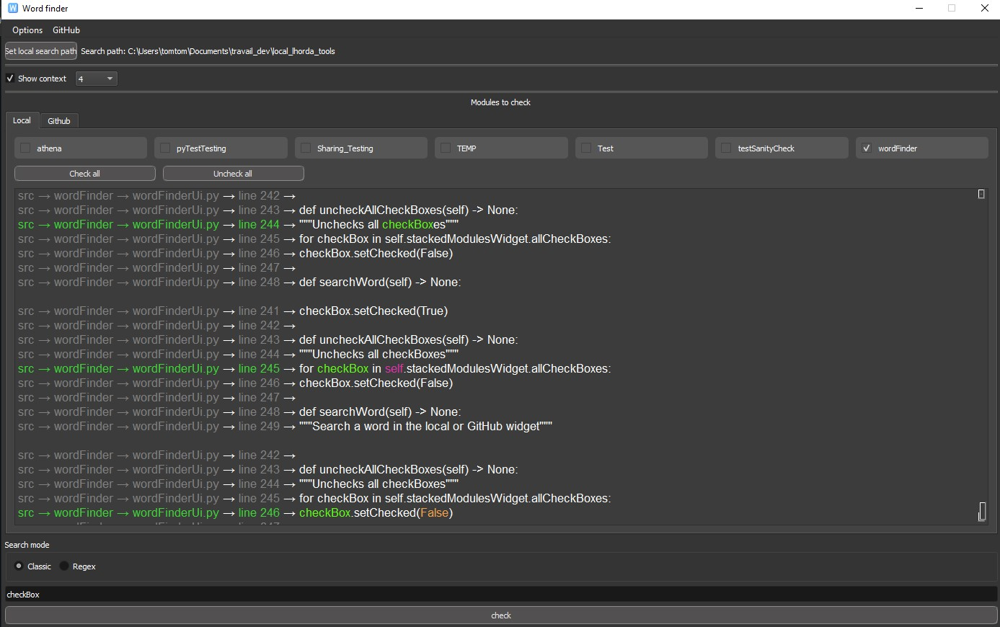

<h1 style="text-align: center;">Word Finder</h1>

<h3>Word Finder</strong> is a tool to search for a word or a sentence in a single module or across multiple Python packages</h3>

### This tool runs on Python < 3.9.

 

>Word finder has two dependency that is [PyGithub](https://github.com/PyGithub/PyGithub) which allows to get an access to the GitHub repositories,
>and PySide 2
- Run .wordFinderStart.bat
- Change the search path. Then, you can search for a word or a sentence in the packages within the search path.

If you want to search on a GitHub repository, go to GitHub &#8594; Set GitHub personal access token, paste your
token then click ok.

    

>> Note: Actually, this tool supports only Python packages / modules.

